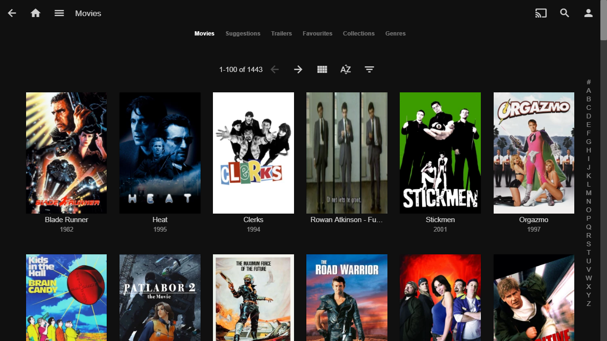

# Jellyfin Theater

Jellyfin Theater is a local client that connects to a Jellyfin server. 
Currently this takes place by contacting http://


# Building

This application is implemented as an electron app and is built off of 
a NodeJS code base. Because of this you will need to NodeJS runtime and
package manager. The following versions have been tested: 

| Software Name | Version          |
| ------------- | ---------------- |
| Node JS       | 11.4.0 >         |
| npm           | 6.4.1            |


## Getting Started Installing Jellyfin Theater

If you are looking to use the Jellyfin Theater you will need to start by downloading this repository via the git command, or by downloading a zip. you can do so by either 

SSH

```
$ git clone git@github.com:jellyfin/jellyfin-theater-electron.git
```

HTTPS

```
$ git clone https://github.com/jellyfin/jellyfin-theater-electron.git
```

Note : If you dont have git installed you can allways download a zip by clicking the green clone or download button on the right and then clicking Download Zip

After downloading the source the source you will need to install the dependencies for the project. You can do so by typing into your terminal 

```
$ cd jellyfin-theater-electron

$ npm install
```

Before you can run the program you will need to configure the database.txt file. You can do so by entering this into the terminal 

```
nano database.txt
```

Delete the file and type in your server IP address, If you dont know what it is it should be the IP that you access the server from. for example my server ip is 192.168.1.251:8096.

NOTE
** YOU MUST REMEMBER THE PORT NUMBER OF :8096 UNLESS YOU CHANGED IT DURING EMBY SETUP **

Once the installation has been finished you will need to run this command in the directory to activate the program.

```
$ npm start
```

## Building And Releasing Jellyfin

Start of building and releasing by commiting as usual, then you want to run these commands for the select operating system when you begin to release a final package version of the app you will then need to install these deps using the following command

```$ npm install -g electron-packager ```

after installing this dependency you will want to create a directory called ```release/``` in the root directory.


Note :
If you are on ubuntu you may need to install additional dependencies

```
# apt-get -y install \
	libgtkextra-dev libgconf2-dev \
	libnss3 \
	libxss1 \
	libasound2 \
	libxtst-dev
```

#### Releasing For Windows

```$ npm run package-win```

#### Releasing For Linux

```$ npm run package-linux```

#### Releasing For Macintosh

```$ npm run package-mac```

## Screenshots





